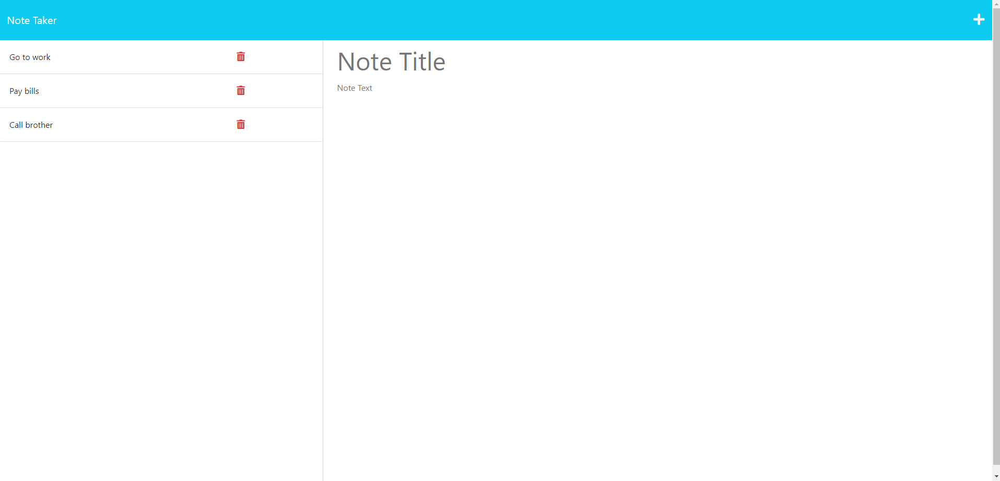
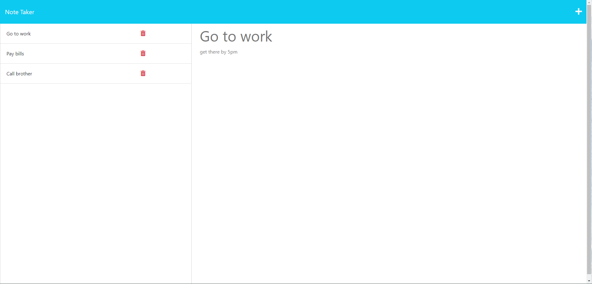

# note-taker-app

## Description

A note taking app where you can easily write notes. You can write a title and text for each note and save them. You can also add more notes with the add icon on the top right but that's not all, you can click your old notes and see them. There is also an option to delete notes once you finish with that note.

## Table of Contents

* [Description](#description)
* [Installation](#installation)
* [Usage](#usage)
* [Code Source](#code-source)

## Installation

Clone repo then run the following line of code in your terminal to install all the needed packages:
```
npm i
```

## Deployment

https://mighty-island-36271-d09f67296834.herokuapp.com/

## Usage




## Code Source

Got some help with deploying to heroku and with POST and GET routes.
